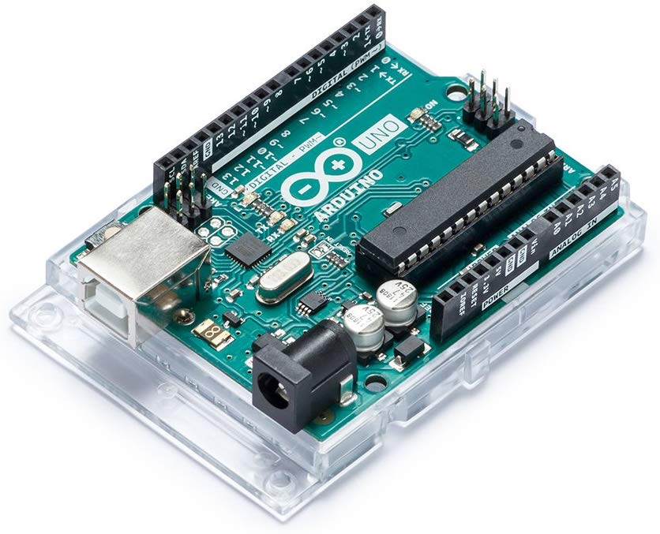

# Arduino optical shutters for free space optical experiments

This is an Arduino project dedicated to automate three home made optical shutters (light caches mounted on a DC motor) used in free space optical experiments. The Arduino board is controlled by a python driver script running on a computer, through a serial (USB) connection.

This repository contains both the arduino microprogramm, and the python driver.

Elements:
- 1x [Arduino Uno Rev 3](https://store.arduino.cc/arduino-uno-rev3) 

- 3x [Parallax Standard Servo](https://www.parallax.com/product/900-00005)

- Wires

