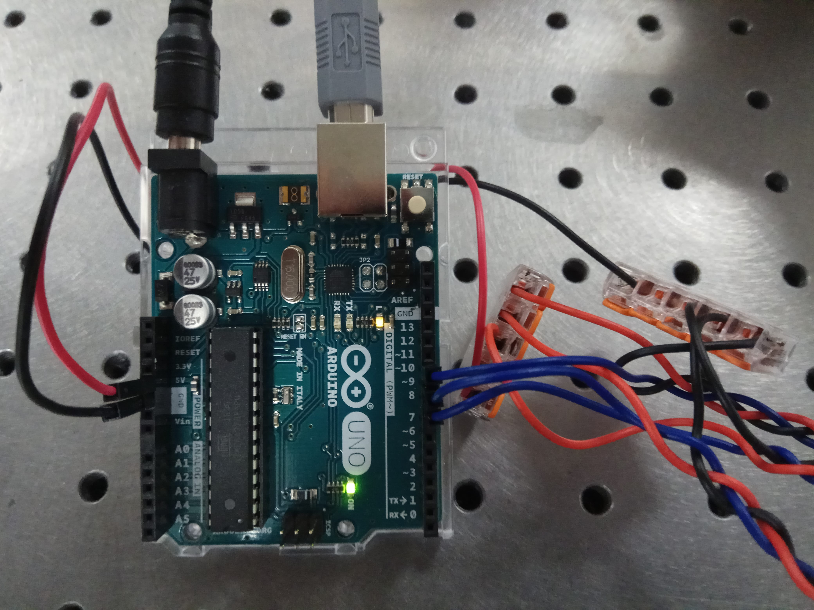

# Arduino optical shutters for free space optical experiments

This is an Arduino project dedicated to automate three home made optical shutters (light caches mounted on a DC motor) used in free space optical experiments. The Arduino board is controlled by a python driver script running on a computer, through a serial (USB) connection.

<p align="center"></p>

This repository contains both the microprogram to flash on the Arduino, and the python driver based on the Python library pyvisa.

## Elements:
- 1x [Arduino Uno Rev 3](https://store.arduino.cc/arduino-uno-rev3) 

- 3x [Parallax Standard Servo](https://www.parallax.com/product/900-00005)

- Wires

## Wiring diagram:


<p align="center"></p>
  


## Python driver:

``` python
arduino = Driver('ASRL::2::INSTR')
arduino.shutter1.set_state(True)        # Enable shutter 1
arduino.shutter2.set_state(False)       # Disable shutter 2
arduino.shutter3.invert()               # Invert state of shutter 3
arduino.set_global_config('1x0')        # Enable shutter 1, don't move shutter 2, disable shutter 3
arduino.safe_state()                    # Enable every shutters
```

You can customize the angles of the ON and OFF states directly in the __init__ function of the Driver class. Use the function ``set_angle``of each shutter to find these particular angles.
